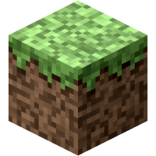

# M4KC

*Minecraft 4K - C Rewrite*

For those who don't know, Minecraft 4K was a stripped down version of Minecraft submitted by Notch to the [Java 4K Game Programming Contest](https://en.wikipedia.org/wiki/Java_4K_Game_Programming_Contest), where each submission had to be under 4 kilobytes in size. Its wiki page can be found [here](https://minecraft.fandom.com/wiki/Minecraft_4k).

Being so small, the game proved somewhat easy to de-compile and edit. [Multiple people have given this a go, including me](https://www.minecraftforum.net/forums/mapping-and-modding-java-edition/minecraft-mods/1290821-minecraft-4k-improved-by-crunchycat-download-now).

This project is an attempt to translate the game into C in order to increase its performance, and to provide a platform upon which to add new features.

## Bug list

* "Sticky" block collision - this behavior is present in the original version and I have been trying to work out ways to fix it for a while.
* Block outline cuts off at mouse x position.

## Goals for this project

* Maintaining the original look and feel as closely as possible.
* Keeping the final executable under 10 KB (on Linux, with the system I have set up in the makefile)
* More blocks
* Perlin noise terrain generation (water, caves, etc)
* Infinite worlds, possibly vertically too
* Mobs and multiplayer (this would require changing the rendering engine to some degree)
* Day/night??? I don't know whether or not this would change the look or feel too much.

## Dependencies

### Bare minimum to make this code run
* SDL2
* A C compiler

### To get it down to a small size, you need
* gcc (have not tried the flags with other compilers)
* gzexe

### On windows, you will need
* Mingw-w64 installed

## Build instructions

### Linux, unix, etc
* To just get a binary, run `make` or `make m4kc`
* To run an uncompressed version, run `make run`
* To install the program, run `make install`
* To uninstall, run `make uninstall`
* To clean, run `make clean`

### Windows
Run `win-build.bat`. Inside of the `win` directory, you will find `m4kc.exe` and `SDL2.dll`. In order for `m4kc.exe` to run, these two must be in the same folder.

## Places

There is a forum thread for this project [here](https://www.minecraftforum.net/forums/mapping-and-modding-java-edition/minecraft-mods/3081789-minecraft-4k-c-rewrite)

I will be uploading binaries [here](https://holanet.xyz/soft/m4kc/)