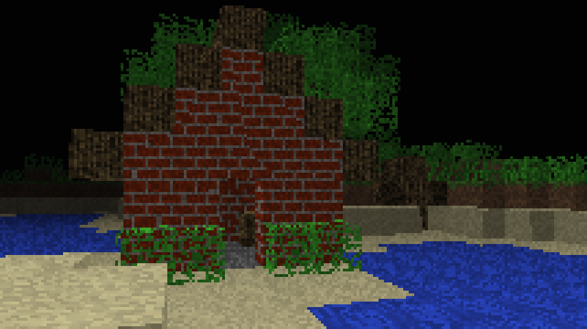
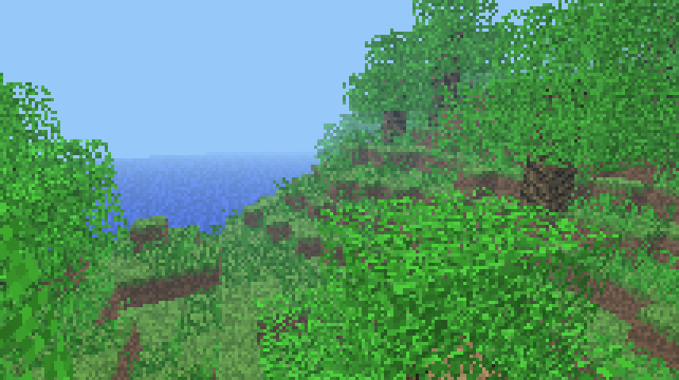
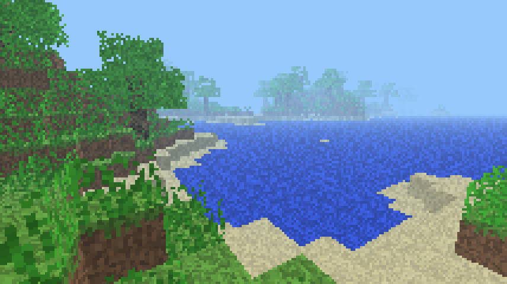

# M4KC


*Minecraft 4K - C Rewrite*

For those who don't know, Minecraft 4K was a stripped down version of Minecraft submitted by Notch to the [Java 4K Game Programming Contest](https://en.wikipedia.org/wiki/Java_4K_Game_Programming_Contest), where each submission had to be under 4 kilobytes in size. Its wiki page can be found [here](https://minecraft.fandom.com/wiki/Minecraft_4k).

Being so small, the game proved somewhat easy to de-compile and edit. [Multiple people have given this a go, including me](https://www.minecraftforum.net/forums/mapping-and-modding-java-edition/minecraft-mods/1290821-minecraft-4k-improved-by-crunchycat-download-now).

This project is an attempt to translate the game into C in order to increase its performance, and to provide a platform upon which to add new features.

## Some goals for this project

* Maintaining the original look and feel as closely as possible. ✅️
* Keeping the final executable under 20 KB (on Linux, with the system I have set up in `build.sh`) ✅️
* More blocks 🏗️
* Perlin noise terrain generation ✅️
  * Water ✅️
  * Biomes 🏗️
  * Caves ✅️
* Infinite worlds, horizontally and vertically too 🏗️
* Mobs and multiplayer (this would require changing the rendering engine to some degree) 🏗️
* Day/night ✅️

*✅️ - got that!*

*🏗️ - not yet...*

## Dependencies

### Bare minimum to make this code run
* SDL2
* A C compiler, such as gcc or clang

### To get it down to a small size, you need
* gzexe

### On windows, you will need
* MSYS2 installed
* mingw-w64-x86_64-gcc installed through MSYS2

## Build instructions

Visit [the wiki](https://github.com/sashakoshka/m4kc/wiki/Building-From-Source) for more detailed build instructions.

### Linux, unix, etc
* To just get a binary, run `./build.sh small` or `./build.sh all small`
* To run an uncompressed version, run `./build.sh` or `./build.sh all`
* To install the program, run `./build.sh install`
* To uninstall, run `./build.sh uninstall`
* To clean, run `./build.sh clean`

### Windows
The exact same as above, but you need to do it within an MSYS2/MINGW64 shell. Instructions on how to do this can be found [here](https://www.msys2.org/docs/terminals/).

### macOS with Xcode
Open Xcode and do a Product -> Build or Command+B. You can also Archive and then export the archive with Organizer -> Distribute App -> Copy App.

Command-line version of the build:
```
# cd apple
# xcodebuild
```

Note: This app won't be distributable without code signing.

## Places

There is a forum thread for this project [here](https://www.minecraftforum.net/forums/mapping-and-modding-java-edition/minecraft-mods/3081789-minecraft-4k-c-rewrite)

I will be uploading binaries [here](https://holanet.xyz/soft/m4kc/)

## FAQ

I've either been asked these, or I expect to be at some point.

> What's with the cryptic variable names like `f22` and `i6`?

A lot of this code is decompiled from the original java version, and those are names the decompiler assigned to the variables. Much of the code is extremely obfuscated due to what are probably compiler optimizations, and some variables have not been deciphered and renamed yet. This is why they mostly appear in the `gameLoop` function.

> Why is it so slow?

The game uses a 3D voxel raycaster to render things, which is a lot slower than more traditional methods of rendering. Luckily, C provides more powerful ways to optimize something like this than Java - and optimizations will keep coming.

> Will you add in \_\_\_\_\_ from Minecraft?

I plan to port over a lot of user interface features, controls, and gameplay mechanics from the official game. However, this game will be taken in its own direction content-wise. For example, crafting will be a part of the game eventually, but creepers will not. New features will be added if they fit with the aesthetic and feel of the game, and make sense from a technichal and gameplay perspective.

## Screenshots

What this actually looks like.

    
