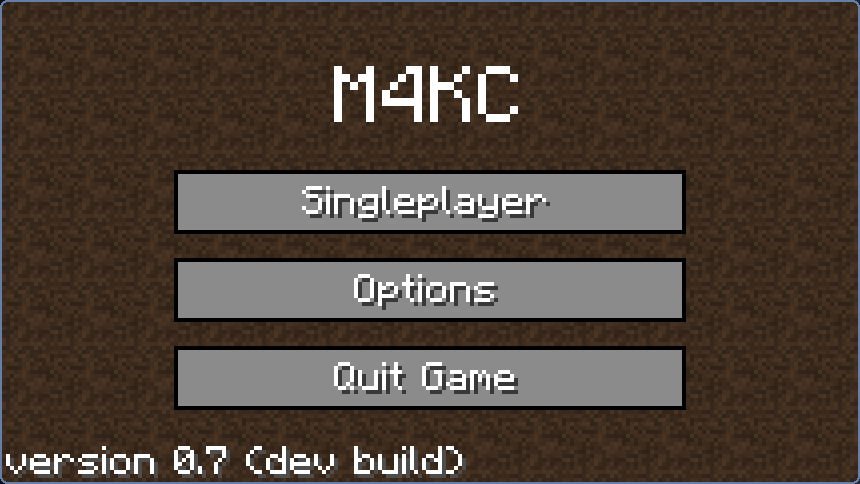
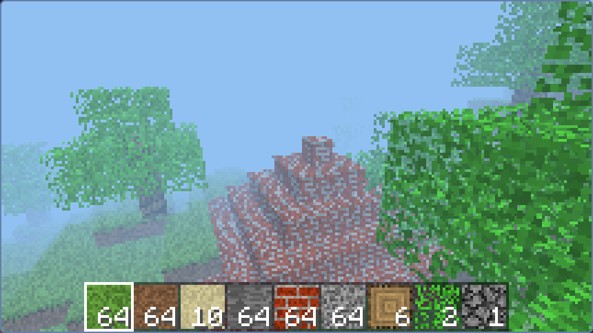
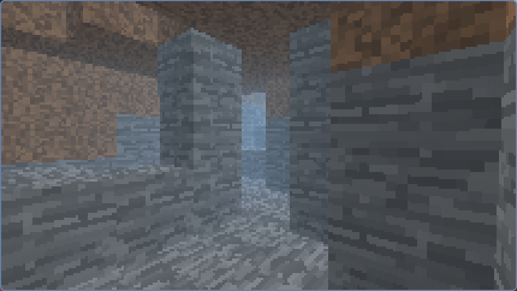
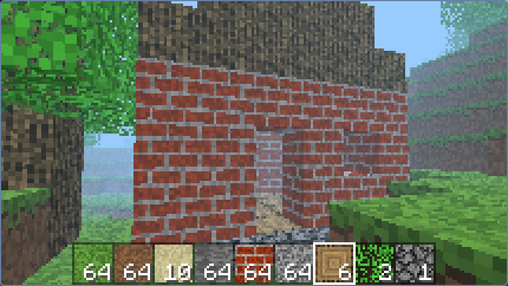

# M4KC

*Minecraft 4K - C Rewrite*

For those who don't know, Minecraft 4K was a stripped down version of Minecraft submitted by Notch to the [Java 4K Game Programming Contest](https://en.wikipedia.org/wiki/Java_4K_Game_Programming_Contest), where each submission had to be under 4 kilobytes in size. Its wiki page can be found [here](https://minecraft.fandom.com/wiki/Minecraft_4k).

Being so small, the game proved somewhat easy to de-compile and edit. [Multiple people have given this a go, including me](https://www.minecraftforum.net/forums/mapping-and-modding-java-edition/minecraft-mods/1290821-minecraft-4k-improved-by-crunchycat-download-now).

This project is an attempt to translate the game into C in order to increase its performance, and to provide a platform upon which to add new features.

## Bug list

* Raycaster breaks at -64 along any axis
* Infinite terrain generation is not fully functional, issues such as chunks flashing in and out of existence are common
* Structure generation does not work in some chunks

## Some goals for this project

* Maintaining the original look and feel as closely as possible. ✅️
* Keeping the final executable under 20 KB (on Linux, with the system I have set up in `build.sh`) ✅️
* More blocks 🏗️
* Perlin noise terrain generation ✅️
  * Water 🏗️
  * Biomes 🏗️
  * Caves ✅️
* Infinite worlds, horizontally and vertically too 🏗️
* Mobs and multiplayer (this would require changing the rendering engine to some degree) 🏗️
* Day/night ✅️

*✅️ - got that!*

*🏗️ - not yet...*

## Dependencies

### Bare minimum to make this code run
* SDL2
* A C compiler, such as gcc or clang

### To get it down to a small size, you need
* gzexe

### On windows, you will need
* Mingw-w64 installed

## Build instructions

### Linux, unix, etc
* To just get a binary, run `./build.sh small` or `./build.sh all small`
* To run an uncompressed version, run `./build.sh` or `./build.sh all`
* To install the program, run `./build.sh install`
* To uninstall, run `./build.sh uninstall`
* To clean, run `./build.sh clean`

### Windows
!!! NOTE !!! This doesn't work anymore. updated Windows build system coming soon.

Run `win-build.bat`. Inside of the `win` directory, you will find `m4kc.exe` and `SDL2.dll`. In order for `m4kc.exe` to run, these two must be in the same folder.

## Places

There is a forum thread for this project [here](https://www.minecraftforum.net/forums/mapping-and-modding-java-edition/minecraft-mods/3081789-minecraft-4k-c-rewrite)

~~I will be uploading binaries [here](https://holanet.xyz/soft/m4kc/)~~

[Holanet](https://holanet.xyz) was recently migrated to the [hlhv architecture](https://github.com/hlhv). The software page has not been migrated yet. For now, binaries will be uploaded to the releases section on GitHub.

## FAQ

I've either been asked these, or I expect to be at some point.

> What's with the cryptic variable names like `f22` and `i6`?

A lot of this code is decompiled from the original java version, and those are names the compiler assigned to the variables. Much of the code is extremely obfuscated due to what are probably compiler optimizations, and a lot of them have not been deciphered and renamed yet. This is why they mostly appear in the `gameLoop` function.

> Why is it so slow?

The game uses a 3D voxel raycaster to render things, which is a lot slower than more traditional methods of rendering. Luckily, C provides more powerful ways to optimize something like this than Java - and optimizations will keep coming.

## Screenshots

What this actually looks like.

